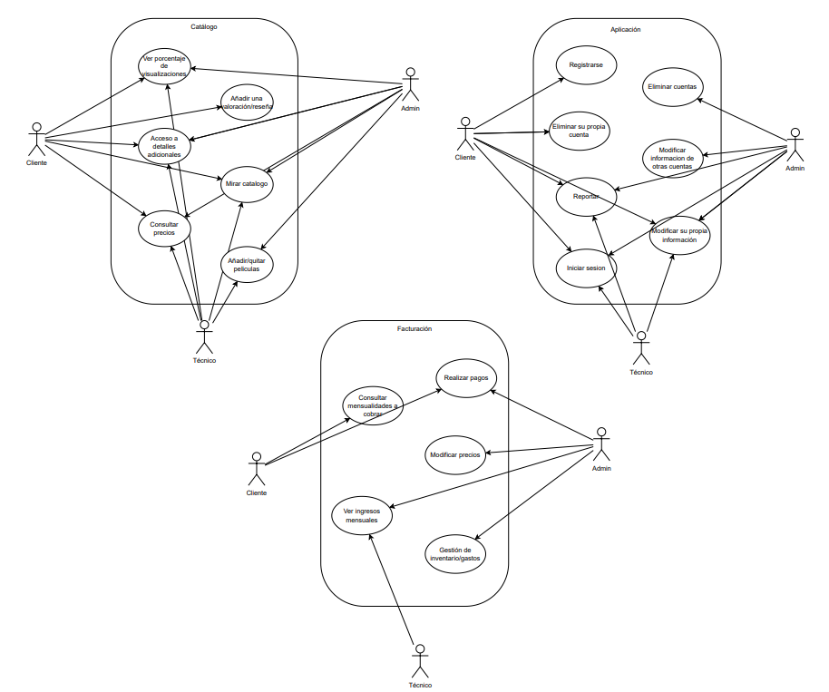

# 🎬 Aplicación de Recomendación de Películas  
**Proyecto de Ingeniería de Software**  
Repostiorio:
https://github.com/csantillgar/Proyecto-Ingenieria-de-Software.git

---

## 1. Introducción

### 1.1 Objetivo general del sistema
El objetivo principal del sistema es diseñar e implementar una aplicación multiplataforma (móvil y escritorio) que recomiende películas a los usuarios de forma personalizada, basándose en sus preferencias, historial de visualizaciones y valoraciones.

La aplicación permite:
- Registro e inicio de sesión de usuarios.
- Consulta del catálogo de películas.
- Valoración y reseñas.
- Generación de recomendaciones mediante un algoritmo híbrido de filtrado colaborativo y basado en contenido.

---

### 1.2 Justificación del proyecto
La proliferación de contenido audiovisual ha generado la necesidad de sistemas que orienten la elección del usuario. Plataformas como Netflix, Filmin o Prime Video utilizan motores de recomendación eficaces, pero cerrados a sus propios catálogos.

Este proyecto persigue crear una **plataforma independiente**, en la que los usuarios puedan gestionar su propia biblioteca y recibir recomendaciones personalizadas sin depender de un proveedor concreto.

---

### 1.3 Alcance y limitaciones

#### Alcance funcional
- Registro, autenticación y gestión de usuarios.
- Consulta del catálogo de películas (por género, título y popularidad).
- Gestión del catálogo por parte de administradores (alta, modificación y eliminación).
- Valoraciones y reseñas de usuarios.
- Algoritmo de recomendación basado en preferencias y valoraciones.
- Módulo de facturación (suscripciones o servicios premium).
- Interfaz móvil y de escritorio con sincronización centralizada.

#### Limitaciones
- No se almacenan ni reproducen películas; únicamente se gestionan datos informativos.
- El motor de recomendación se basa en datos internos, sin integración con plataformas externas.
- No se contempla un escenario de carga masiva de usuarios (no es un sistema distribuido a gran escala).

---

### 1.4 Beneficios esperados
- Experiencia personalizada para cada usuario.
- Centralización de datos y control administrativo del catálogo.
- Escalabilidad modular del sistema.
- Iteraciones y mejoras continuas mediante un ciclo de vida ágil.
- Aplicación de buenas prácticas de ingeniería del software: trazabilidad, modelado, control de versiones y calidad del código.

---

### 1.5 Glosario de términos

| Término | Definición |
|------|-----------|
| **Actor** | Rol que interactúa con el sistema (usuario, técnico, administrador). |
| **Caso de uso** | Funcionalidad observable por un actor que produce un resultado concreto. |
| **Recomendación** | Sugerencias de películas según hábitos y valoraciones. |
| **Catálogo** | Base de datos de películas con metadatos. |
| **Backend** | Lógica de negocio implementada en Java con Spring Boot. |
| **Frontend** | Interfaz de usuario en JavaFX (escritorio) y Flutter (móvil). |
| **API REST** | Servicios HTTP que intercambian datos en formato JSON. |
| **Scrum** | Metodología ágil basada en sprints e iteración continua. |

---

## 2. Ingeniería del Software: Enfoque y contexto

### 2.1 Naturaleza del software y motivación
Sistema de información inteligente orientado a la personalización. Se trata de un software evolutivo, dependiente del comportamiento del usuario, que requiere un proceso sistemático para reducir riesgos de desalineación con los requisitos.

---

### 2.2 Tipo de sistema y clasificación
- Sistema de información con componente inteligente (motor de recomendación).
- Aplicación híbrida multiplataforma (escritorio y móvil).
- Arquitectura cliente-servidor RESTful.
- Componentes:
  - **Datos**: base de datos relacional.
  - **Lógica**: Spring Boot.
  - **Presentación**: JavaFX / Flutter.

---

### 2.3 Ciclo de vida elegido
Ciclo de vida ágil iterativo-incremental basado en Scrum, con sprints de 2–3 semanas.  
Cada sprint entrega incrementos funcionales: usuarios, catálogo, recomendaciones y facturación.

---

### 2.4 Roles implicados

| Rol | Descripción |
|----|-------------|
| Product Owner | Prioriza el backlog y valida las entregas. |
| Scrum Master | Facilita el proceso y elimina impedimentos. |
| Equipo de desarrollo | Programadores, diseñadores UI y QA. |
| Usuarios finales | Aportan retroalimentación funcional y de usabilidad. |
| Administrador del sistema | Gestiona catálogo, cuentas y estadísticas. |

---

### 2.5 Riesgos y mitigación

| Riesgo | Descripción | Mitigación |
|------|-------------|-----------|
| Requisitos cambiantes | Cambios en prioridades o criterios de recomendación | Backlog dinámico y revisiones periódicas |
| Desviaciones de tiempo | Subestimación de integración multiplataforma | Estimación por puntos y burndown |
| Errores en BD | Pérdida o corrupción de datos | Backups y pruebas de integración |
| Falta de validación | Código sin revisión | Análisis estático y TDD |
| Dependencias tecnológicas | Limitaciones de frameworks | Inventario y plan de actualización |

---

### 2.6 Estándares de calidad aplicables
- ISO/IEC 25010 – Calidad del producto software.
- ISO/IEC 12207 – Procesos del ciclo de vida.
- IEEE 829 – Documentación de pruebas.
- Convenciones Java y Spring Boot (estilo, modularidad, manejo de excepciones).

---

## 3. Ingeniería de requisitos

### 3.1 Stakeholders

| Rol | Interés | Influencia |
|----|---------|------------|
| Usuario | Usabilidad y calidad de recomendaciones | Alto |
| Administrador | Control del catálogo | Alto |
| Técnico | Mantenimiento y rendimiento | Medio |
| Desarrolladores | Correcta implementación | Alto |
| Product Owner | Priorización | Muy alto |
| Scrum Master | Metodología | Medio |

---

### 3.2 Obtención y análisis
Entrevistas, observación, análisis comparativo (Netflix, IMDb, FilmAffinity), prototipos y backlog de historias de usuario.  
Resultado: definición del MVP.

---

### 3.3 Requisitos funcionales

| Código | Descripción | Prioridad |
|-----|------------|----------|
| RF-01 | Registro de usuarios | Must |
| RF-02 | Inicio y cierre de sesión | Must |
| RF-03 | Modificar o eliminar cuenta | Should |
| RF-04 | Catálogo filtrable | Must |
| RF-05 | Valoraciones y reseñas | Must |
| RF-06 | Recomendaciones personalizadas | Must |
| RF-07 | Gestión del catálogo | Must |
| RF-08 | Estadísticas | Should |
| RF-09 | Pagos premium | Could |
| RF-10 | Reportes técnicos | Should |

---

### 3.4 Requisitos no funcionales

| Código | Descripción | Tipo |
|-----|-------------|------|
| RNF-01 | Disponibilidad ≥ 99 % | Fiabilidad |
| RNF-02 | Respuesta ≤ 3 s | Eficiencia |
| RNF-03 | Multiplataforma | Portabilidad |
| RNF-04 | Interfaz intuitiva | Usabilidad |
| RNF-05 | Cumplimiento RGPD | Seguridad |
| RNF-06 | Buenas prácticas Java | Mantenibilidad |

---

### 3.5 Priorización y planificación
**MoSCoW**:
- Must: RF-01, RF-02, RF-04, RF-05, RF-06, RF-07
- Should: RF-03, RF-08, RF-10
- Could: RF-09

**Sprints**:
1. Registro, login y catálogo básico  
2. Valoraciones y recomendaciones  
3. Administración y estadísticas  
4. Pagos y mejoras de usabilidad  

---

## 4. Modelado UML y modelo de datos

### 4.1 Casos de uso
Actores: Cliente, Administrador, Técnico y sistema de pagos externo.

Casos principales:
- Autenticarse
- Gestionar cuenta
- Explorar catálogo
- Gestionar catálogo
- Gestionar facturación
- Mantenimiento técnico

---

### 4.2 Diagramas
- Diagrama de casos de uso  
- Diagrama de clases  
- Diagrama de secuencia  
- Diagrama de actividad  
- Modelo Entidad-Relación  

---

### 1. Diagrama de casos de uso
   

### 2. Diagrama de clases

### 3. Diagrama de secuencia

### 4. Diagrama de Actividad

### 5. Modelo Entidad-Relacion

   

